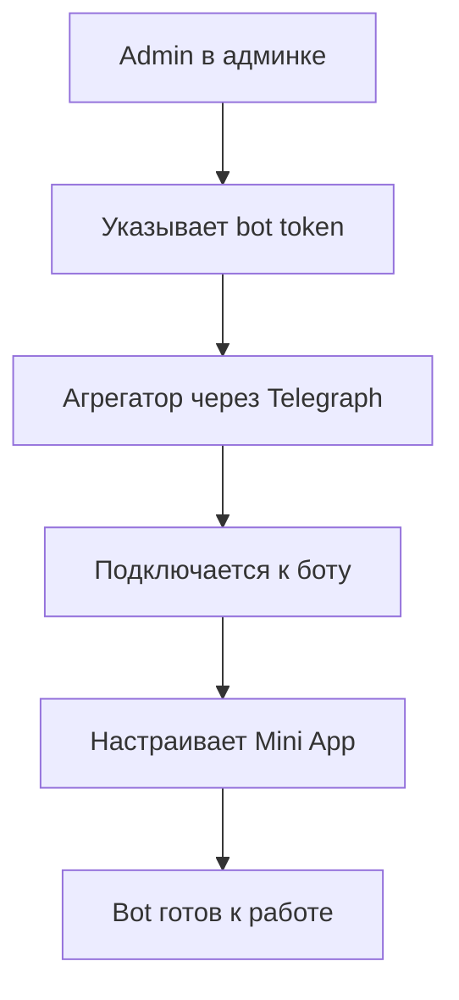

# Architecture Decisions - Restaurant Aggregator Platform

## User Roles & Authentication Architecture

### 🔐 **Authentication Strategy**
```typescript
interface UserRoles {
  admin: {
    loginLocation: 'Admin Panel (/admin)'
    permissions: ['create_restaurants', 'view_all_content', 'moderate_content']
    registration: 'Manual creation only'
  }
  restaurant_owner: {
    loginLocation: 'Restaurant Dashboard (/restaurant)'
    permissions: ['edit_own_restaurant', 'manage_own_content']
    registration: 'Created by admins'
  }
  customer: {
    loginLocation: 'Telegram Mini App'
    permissions: ['view_restaurants', 'like_content']
    registration: 'No registration - Telegram API data only'
  }
}
```

### 👤 **No Customer Registration Policy**
- **Telegram Users**: Все данные получаются из Telegram API
- **No Database Storage**: Пользователи НЕ хранятся в базе  
- **Session-Based**: Временные сессии для лайков и взаимодействий
- **Privacy First**: Минимум данных, максимум приватности

## Telegram Integration Architecture

### 🤖 **Bot Token Management Flow**


### 📱 **Mini App Deployment Process**
1. **Admin Input**: Админ вводит bot token в админке
2. **Telegraph Connection**: Агрегатор подключается через DefStudio/Telegraph
3. **Auto Configuration**: Автоматическая настройка webhook и команд
4. **Restaurant Binding**: Привязка бота к ресторану
5. **Menu Integration**: Подключение меню ресторана к Mini App

## Database Schema Architecture

### 🏪 **Restaurant-Centric Design**
```sql
-- Core restaurant entity
restaurants (
  uuid,
  name,
  description,
  telegram_bot_token,    -- Encrypted storage
  is_active,
  created_by_admin_id,   -- Which admin created
  created_at,
  updated_at
)

-- Menu structure  
menus (uuid, restaurant_id, name, is_active)
dishes (uuid, menu_id, name, description, price, image_path)
categories (uuid, name, parent_id, type)  -- Hierarchical
dish_categories (dish_id, category_id)    -- Many-to-many

-- Events without geolocation
events (
  uuid,
  restaurant_id, 
  title,
  description,
  start_date,
  end_date,
  max_participants
)

-- Social features (no user registration)
likes (
  uuid,
  telegram_user_id,     -- From Telegram API
  likeable_type,         -- Polymorphic
  likeable_id,
  created_at
)

-- Admin curated content
curated_collections (uuid, title, type, created_by_admin_id)
collection_items (collection_id, item_type, item_id)
```

### 🔒 **Permission-Based Access Control**
```php
// Policy examples
class RestaurantPolicy {
    public function update(User $user, Restaurant $restaurant): bool 
    {
        // Only restaurant owner can edit their restaurant
        return $user->id === $restaurant->owner_id;
    }
    
    public function viewAny(User $user): bool 
    {
        // Admins see all, owners see only theirs
        return $user->isAdmin() || $user->isRestaurantOwner();
    }
}

class DishPolicy {
    public function create(User $user, Restaurant $restaurant): bool
    {
        // Only restaurant owner can add dishes to their menu
        return $user->ownsRestaurant($restaurant);
    }
}
```

## File Storage Architecture

### 📁 **Restaurant-Specific Folders**
```
storage/app/restaurants/
├── {restaurant_uuid}/
│   ├── dishes/
│   │   ├── originals/
│   │   ├── thumbnails/
│   │   └── compressed/
│   ├── events/
│   └── logos/
└── shared/
    ├── categories/
    └── platform/
```

### 🖼️ **Image Processing Pipeline**
```php
class ImageService {
    public function storeRestaurantImage(
        UploadedFile $file, 
        Restaurant $restaurant, 
        string $type = 'dish'
    ): string {
        $folder = "restaurants/{$restaurant->uuid}/{$type}s";
        
        // Store original
        $originalPath = $file->store("{$folder}/originals");
        
        // Generate thumbnails
        $this->generateThumbnail($originalPath, $folder);
        
        // Optimize for Mini Apps
        $this->compressForMobile($originalPath, $folder);
        
        return $originalPath;
    }
}
```

## TypeScript Integration (ModelTyper)

### 🔧 **Automatic Type Generation**
```bash
# Установка ModelTyper
composer require --dev fumeapp/modeltyper

# Генерация типов
php artisan model:typer --output-file=resources/js/shared/types/models.d.ts

# Автоматическая генерация при изменении моделей
make types  # Alias для команды выше
```

### 📁 **Generated Types Structure**
```typescript
// resources/js/shared/types/models.d.ts
export interface Restaurant {
  // columns
  id: string;  // UUID
  name: string;
  description: string;
  telegram_bot_token: string;
  is_active: boolean;
  created_by_admin_id: string;
  created_at?: Date;
  updated_at?: Date;
  
  // relations
  menus: Menu[];
  events: Event[];
  owner: User;
}

export interface Menu {
  id: string;
  restaurant_id: string;
  name: string;
  is_active: boolean;
  created_at?: Date;
  updated_at?: Date;
  
  // relations
  restaurant: Restaurant;
  dishes: Dish[];
}

export interface Dish {
  id: string;
  menu_id: string;
  name: string;
  description: string;
  price: number;
  image_path?: string;
  is_available: boolean;
  created_at?: Date;
  updated_at?: Date;
  
  // relations
  menu: Menu;
  categories: Category[];
  likes: Like[];
}

export interface Category {
  id: string;
  name: string;
  parent_id?: string;
  type: string;
  created_at?: Date;
  updated_at?: Date;
  
  // relations
  dishes: Dish[];
  parent?: Category;
  children: Category[];
}

export interface Event {
  id: string;
  restaurant_id: string;
  title: string;
  description: string;
  start_date: Date;
  end_date: Date;
  max_participants?: number;
  created_at?: Date;
  updated_at?: Date;
  
  // relations
  restaurant: Restaurant;
  registrations: EventRegistration[];
  likes: Like[];
}

export interface Like {
  id: string;
  telegram_user_id: string;
  likeable_type: string;
  likeable_id: string;
  created_at?: Date;
}

export type Restaurants = Restaurant[];
export type Menus = Menu[];
export type Dishes = Dish[];
export type Categories = Category[];
export type Events = Event[];
export type Likes = Like[];
```

### 🔄 **Type-Safe API Integration**
```typescript
// resources/js/shared/api/restaurants.ts
import type { Restaurant, Restaurants } from '@types/models';

export const restaurantsApi = {
  async getAll(): Promise<Restaurants> {
    const response = await axios.get('/api/restaurants');
    return response.data;
  },
  
  async getById(id: string): Promise<Restaurant> {
    const response = await axios.get(`/api/restaurants/${id}`);
    return response.data;
  },
  
  async create(data: Partial<Restaurant>): Promise<Restaurant> {
    const response = await axios.post('/api/restaurants', data);
    return response.data;
  }
};
```

### 🎯 **Pinia Store Type Safety**
```typescript
// resources/js/shared/stores/restaurant.ts
import { defineStore } from 'pinia';
import type { Restaurant, Restaurants } from '@types/models';

export const useRestaurantStore = defineStore('restaurant', {
  state: () => ({
    restaurants: [] as Restaurants,
    currentRestaurant: null as Restaurant | null,
    loading: false,
  }),
  
  actions: {
    async fetchRestaurants(): Promise<void> {
      this.loading = true;
      try {
        this.restaurants = await restaurantsApi.getAll();
      } finally {
        this.loading = false;
      }
    },
    
    async createRestaurant(data: Partial<Restaurant>): Promise<Restaurant> {
      const restaurant = await restaurantsApi.create(data);
      this.restaurants.push(restaurant);
      return restaurant;
    }
  }
});
```

## Frontend Architecture Decisions

### 🎨 **Three Distinct Interfaces**
```typescript
// resources/js/admin/ - Admin Panel
interface AdminApp {
  features: [
    'restaurant-management',
    'content-moderation', 
    'curated-collections',
    'bot-configuration'
  ]
  authentication: 'Laravel session-based'
  permissions: 'Full platform access'
}

// resources/js/restaurant/ - Restaurant Dashboard  
interface RestaurantApp {
  features: [
    'menu-management',
    'event-planning',
    'analytics-viewing'
  ]
  authentication: 'Laravel session-based'
  permissions: 'Own restaurant only'
}

// resources/js/site/ - Public Site
interface PublicSite {
  features: [
    'restaurant-catalog',
    'content-discovery',
    'collection-browsing'
  ]
  authentication: 'None required'
  permissions: 'Read-only public content'
}
```

### 🔄 **State Management Strategy**
```typescript
// Pinia stores per interface
interface StoreArchitecture {
  admin: {
    restaurantStore: 'Manage all restaurants'
    contentModerationStore: 'Moderate all content' 
    collectionStore: 'Create curated collections'
  }
  restaurant: {
    menuStore: 'Manage own menu'
    eventStore: 'Manage own events'
    analyticsStore: 'View own analytics'
  }
  site: {
    discoveryStore: 'Browse restaurants'
    collectionStore: 'View curated content'
  }
}
```

## Business Logic Patterns

### 🎯 **Restaurant Content Ownership**
```php
class MenuManagementService {
    public function createDish(User $user, Restaurant $restaurant, array $data): Dish
    {
        // Ensure user owns this restaurant
        $this->authorize($user, $restaurant);
        
        $dish = Dish::create([
            'menu_id' => $restaurant->menu->id,
            'name' => $data['name'],
            'price' => $data['price'],
            // ...
        ]);
        
        // Handle image upload to restaurant folder
        if ($data['image']) {
            $imagePath = $this->imageService->storeRestaurantImage(
                $data['image'], 
                $restaurant, 
                'dish'
            );
            $dish->update(['image_path' => $imagePath]);
        }
        
        return $dish;
    }
}
```

### 📊 **Telegram Analytics Without User Storage**
```php
class TelegramAnalyticsService {
    public function trackLike(string $telegramUserId, Likeable $item): void
    {
        // Store like without storing user data
        Like::create([
            'telegram_user_id' => $telegramUserId,
            'likeable_type' => get_class($item),
            'likeable_id' => $item->id,
        ]);
        
        // Update trending cache
        $this->updateTrendingCache($item);
    }
    
    public function getRestaurantAnalytics(Restaurant $restaurant): array
    {
        return [
            'total_likes' => $this->getTotalLikes($restaurant),
            'popular_dishes' => $this->getPopularDishes($restaurant),
            'engagement_rate' => $this->calculateEngagement($restaurant),
        ];
    }
}
```

## Security Considerations

### 🔐 **Bot Token Security**
```php
// Encrypted storage of bot tokens
class Restaurant extends BaseModel {
    protected $casts = [
        'telegram_bot_token' => 'encrypted',
    ];
    
    public function getBotTokenAttribute($value): ?string
    {
        return $value ? decrypt($value) : null;
    }
}
```

### 🛡️ **Telegram Data Validation**
```php
class TelegramUserValidator {
    public function validateTelegramAuth(array $telegramData): bool
    {
        // Validate Telegram auth hash
        $checkHash = $telegramData['hash'];
        unset($telegramData['hash']);
        
        $dataCheckString = collect($telegramData)
            ->sortKeys()
            ->map(fn($value, $key) => "{$key}={$value}")
            ->implode("\n");
            
        $secretKey = hash('sha256', config('telegram.bot_token'), true);
        $computedHash = hash_hmac('sha256', $dataCheckString, $secretKey);
        
        return hash_equals($checkHash, $computedHash);
    }
}
```

## Performance & Scaling Decisions

### ⚡ **Caching Strategy**
```php
// Cache popular content without storing users
class ContentCacheService {
    public function getCachedPopularDishes(int $limit = 10): Collection
    {
        return Cache::remember('popular_dishes', 3600, function() use ($limit) {
            return Dish::withCount('likes')
                ->orderBy('likes_count', 'desc')
                ->limit($limit)
                ->get();
        });
    }
    
    public function invalidateRestaurantCache(Restaurant $restaurant): void
    {
        Cache::forget("restaurant_{$restaurant->uuid}_menu");
        Cache::forget("restaurant_{$restaurant->uuid}_events");
    }
}
```

## Deployment & Environment Strategy

### 🐳 **Development Environment (Docker)**
```yaml
# docker-compose.yml - Local development
services:
  app: Laravel + PHP 8.2-FPM
  nginx: Web server с SSL
  mysql: Database server
  redis: Cache & sessions
  phpmyadmin: DB admin interface
  node: Frontend build процессы
```

### 🌐 **Production Environment (Standard Hosting)**
```bash
# Обычный хостинг без Docker
- PHP 8.2+ с модулями (MySQL, Redis, GD, etc.)
- MySQL/MariaDB database
- Redis для кэширования (если доступен)
- Web server (Apache/Nginx)
- File storage в обычной файловой системе
```

### 📁 **Storage Strategy Differences**
```php
// Development (Docker volumes)
storage/app/restaurants/ -> Docker volume mapping

// Production (Regular hosting)  
storage/app/restaurants/ -> Обычная файловая система
public/storage/ -> Symlink для публичного доступа к изображениям
```

### ⚙️ **Configuration Management**
```env
# .env.development (Docker)
DB_HOST=mysql
REDIS_HOST=redis
APP_URL=http://localhost:8080

# .env.production (Regular hosting)
DB_HOST=localhost
REDIS_HOST=127.0.0.1
APP_URL=https://yourdomain.com
FILESYSTEM_DISK=public
```

### 🚀 **Build & Deployment Process**
```bash
# Development workflow
make up              # Docker containers
make dev             # Vite dev servers
make shell           # Container access

# Production deployment
composer install --no-dev --optimize-autoloader
npm run build        # Vite production build
php artisan optimize:clear
php artisan config:cache
php artisan route:cache
php artisan view:cache
php artisan storage:link
```

### 🔧 **Production Optimizations**
```php
// config/session.php - Production settings
'driver' => env('SESSION_DRIVER', 'file'), // Fallback если нет Redis

// config/cache.php - Production caching
'default' => env('CACHE_DRIVER', 'file'), // Fallback strategy

// config/filesystems.php - Production storage
'default' => env('FILESYSTEM_DISK', 'public'),
'links' => [
    public_path('storage') => storage_path('app/public'),
],
```

This architecture ensures clean separation of concerns, proper security for restaurant data, efficient Telegram integration without unnecessary user data storage, and seamless transition from Docker development to standard hosting production. 